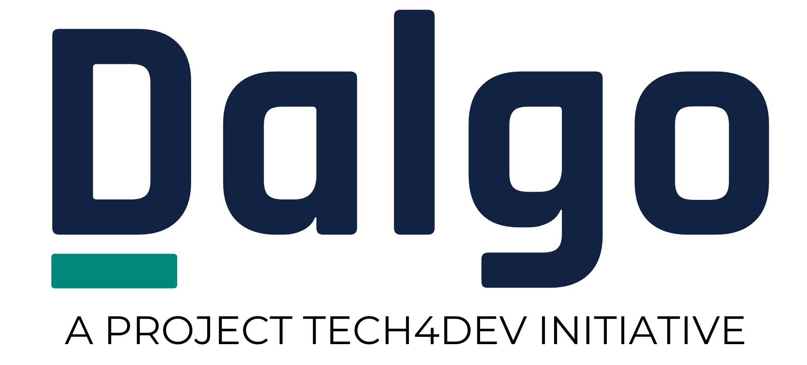

<p align="center">
  
</p>

<h1 align="center">Data Insights Platform for Nonprofits</h1>

<p align="center"><strong>Know your data. Share your story.</strong></p>

<p align="center">
  <a href="https://dalgo.org">dalgo.org</a> ·
  <a href="https://github.com/DalgoT4D">GitHub (DalgoT4D)</a> ·
  <a href="https://www.digitalpublicgoods.net/r/dalgo">Digital Public Good</a> ·
  <a href="https://projecttech4dev.org">Project Tech4Dev</a>
</p>

---

Dalgo is a data insights platform built exclusively for nonprofits. It brings scattered programme data into one trusted source your whole team can act on — for monthly reflections, funder reporting, and everyday decisions. Built by a nonprofit, for the social sector.

> This repository holds the source for the **Dalgo website**, [dalgo.org](https://dalgo.org). The Dalgo platform itself is developed in the open at [github.com/DalgoT4D](https://github.com/DalgoT4D).

## The problem

Programmes generate data in a dozen places — surveys, chatbots, spreadsheets, case-management tools. For most M&E and programme teams, every monthly reflection means cleaning, analysing, and preparing decks by hand, often a week of work before anyone can look at a number. The data arrives late, and leadership ends up deciding on figures they can't fully stand behind.

## What Dalgo does

**Automate the chaos.** Custom-built connectors for the tools NGOs already use — KoboToolbox, CommCare, SurveyCTO, Avni, Glific, MGrant, ODK — plus 600+ more sources through Airbyte. Data lands in a warehouse that belongs to your organisation, cleaned and consolidated on a schedule, with no manual crunching.

**Illuminate the story.** That clean data becomes dashboards leadership can act on, reports that generate themselves, and impact pages that show funders what the work achieves.

The result is better decision-making — the reason nonprofits stay. The hours saved along the way are the proof.

Core capabilities:

- **Data integration** — every source syncing into your own warehouse
- **Dashboards & charts** — self-service views for programme teams, leadership, and donors
- **Reports & alerts** — scheduled reporting and notifications, without the repetitive prep
- **Trust & access** — role-based access, and data that stays yours

## Who it's for

- **Programme & M&E teams** — automate the cleaning, analysing, and deck-building that eats the month
- **Leadership** — dashboards and credibility to give funders real visibility
- **Field teams** — real-time data where the work happens
- **Funders** — impact pages that show what a programme actually achieved

## Proof

25+ nonprofits across multiple sectors run their data on Dalgo, with under 10% churn.

- **STiR Education** — monthly review prep went from **one week to one hour**, across six regions, handled by one person.
- **SHRI** — reporting effort fell from **20+ hours a week to under one**.
- **SHOFCO** — caseworkers went from **12+ hours a week to about two** on navigation and report generation.
- **SNEHA** — monthly reports became daily field access, scaling from one programme to three and more.

> "It's thrilling to finally see an affordable service built on open-source software to support non-profits in making evidence-based decisions."
>
> — Jacob Hughey, Core Team Member, The Agency Fund

## Open source, and your data stays yours

- **Open source** — the platform is developed in the open at [DalgoT4D](https://github.com/DalgoT4D), licensed AGPL-3.0.
- **Digital Public Good** — recognised by the [Digital Public Goods Alliance](https://www.digitalpublicgoods.net/r/dalgo).
- **Your data, your warehouse** — data lives in your organisation's own warehouse. Dalgo processes it only to run the service you signed up for. DPDP-readiness is in progress.
- **Predictable pricing** — no per-user, per-source, or per-row charges. Flat from one programme to five and beyond.

Dalgo is co-built with the sector — organisations like STiR Education, SNEHA, SHRI, and Antarang — and supported by an ecosystem that includes the Agency Fund, Goalkeep, and Dasra.

## Community

Dalgo runs an open community for nonprofit data practitioners:

- **Decoding Data** — a LinkedIn newsletter on nonprofit data, every two weeks
- **Monthly webinars** — live product sessions and sector data education
- **WhatsApp community** — peer support across the social sector
- Plus a newsletter, published stories, and offline meetups

## Running this site on your own computer

You don't need to know how to code to do this — just follow the steps below in order.

### 1. Install Node.js (one-time setup)

Node.js is the program that runs the site's build tools. If you're not sure whether you already have it, open a terminal and type:

```bash
node -v
```

If you see a version number (like `v20.11.0`), you already have it — skip to step 2. If you see an error instead, download and install it from [nodejs.org](https://nodejs.org) (choose the "LTS" version), then try `node -v` again.

### 2. Install the project's tools (one-time setup, per copy of the project)

From the project folder, run:

```bash
npm install
```

This downloads the small set of tools the site needs to build. You'll only need to do this once (or again if it's ever deleted).

### 3. Build the site

```bash
npm run build
```

This takes the source files and turns them into the files the website actually uses. Run this command any time someone changes a file in the `components/` or `pages/src/` folders — it's what keeps the live site in sync with those changes.

### 4. Preview the site locally

```bash
npm run dev
```

This builds the site (same as step 3) and then starts a small local preview server. Once you see a message like:

```
Dalgo site running at http://localhost:8080
```

open **[http://localhost:8080](http://localhost:8080)** in your web browser — that's the site, running on your own computer. Press `Ctrl+C` in the terminal to stop it when you're done.

> **Note for anyone actively editing components:** if you're making a lot of small changes and want them picked up automatically, run `npm run watch` in one terminal (it rebuilds every time you save a file) and `npm run dev` in another (to keep previewing). Most people won't need this — `npm run dev` alone is enough for a one-off preview.

## About

Dalgo is an initiative of **[Project Tech4Dev](https://projecttech4dev.org)** — building open-source, affordable technology for the social sector.

- **Website** — [dalgo.org](https://dalgo.org)
- **Start a free trial** — [dashboard.dalgo.org](https://dashboard.dalgo.org)
- **Platform source code** — [github.com/DalgoT4D](https://github.com/DalgoT4D)
- **Contact** — [support@dalgo.org](mailto:support@dalgo.org)

<p align="center"><sub>© 2026 Project Tech4Dev</sub></p>
